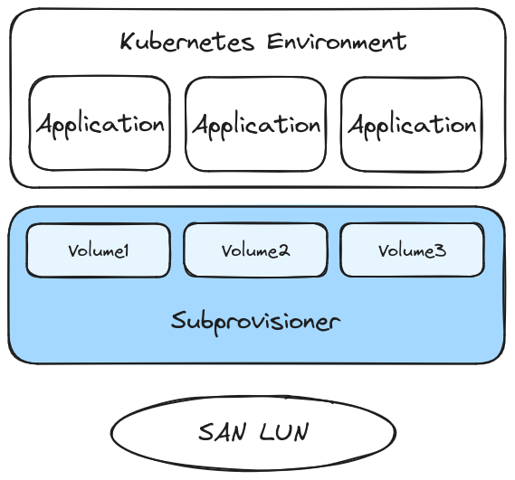

# The KubeSAN CSI Plugin

KubeSAN is a [CSI] plugin for [Kubernetes] that enables you to provision
volumes backed by a single, cluster-wide, shared block device (*e.g.*, a single
big LUN on a SAN), exposed as a shared Volume Group under lvm2.

Whilst SANs often come with vendor CSI plugins, they cannot always be used.
KubeSAN is intended for cases where:
- No vendor CSI plugin is available, the vendor plugin is broken, or lacks features.
- The vendor CSI plugin cannot be used due to organizational reasons (storage
  team does not want to give Kubernetes team access).
- 1 SAN LUN per `PersistentVolume` is undesirable for scalability or
  organizational reasons.

In these cases KubeSAN steps in to provide storage without help from a
vendor CSI plugin.

Features:
- Dynamic provisioning of `Block` and `Filesystem` volumes
- Snapshots
- Cloning
- `ReadWriteMany` (RWX) support for `Block` volumes
- Thin provisioning

Roadmap:
- [ ] Recovery after power failure. Currently requires manual intervention.
- [ ] Volume expansion
- [ ] Instant volume cloning via background copy

### Documentation

1. [Getting started](docs/1-getting-started.md)
2. [Architecture](docs/2-architecture.md)
3. [Development](docs/3-development.md)

### Reporting issues

[Create an issue] on GitLab or send an email to afaria@redhat.com.

### License

This project is released under the Apache 2.0 license. See [LICENSE](LICENSE).

[Create an issue]: https://gitlab.com/kubesan/kubesan/-/issues
[CSI]: https://github.com/container-storage-interface/spec
[Kubernetes]: https://kubernetes.io/
